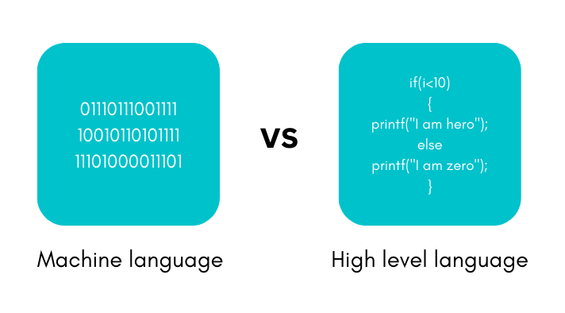
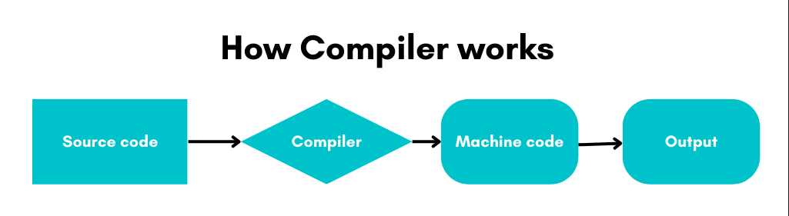
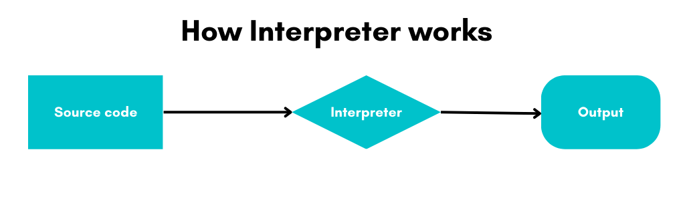
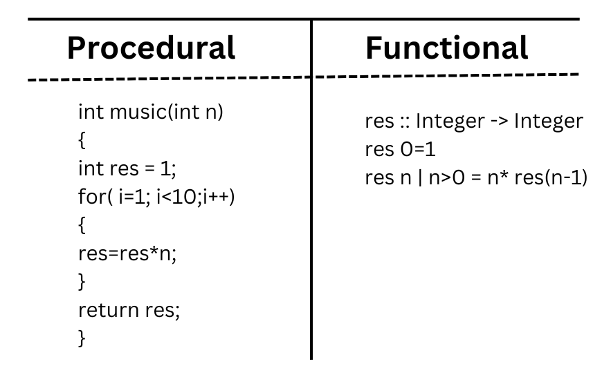

# Programming Concepts

## Programming
In basic terms, programming is the process of creating a set of instructions that instructs the computer to perform a task.
Consider an example where you input two values and want to find the sum of it. 
In this program, you are asked to enter two values. The two values are stored in variables `value1` and `value2`. Then, they are added using the `+` operator and the result is stored in the `result` variable.

```java
Step 1: Create variables value1, value2, and result to store the values.
Step 2: Take input for value1 and value2 from user.
Step 3: result = value1 + value2.
Setp 4: Print result.
```

Then, the result is displayed.

## Programmer
In basic terms, a programmer is defined as the person who builds the program to run and execute a specific task.

## Machine language
As humans, we are equipped with the ability to learn multiple languages. Sadly, computers don't hlave that ability. They are designed in a way to read 0s and 1s. Yes, you are right. Computers convert everything we say into 0s and 1s and that's what we call as machine language. But imagine telling a computer to design a website just by inputing 0s and 1s. It's impossible for a human to do that, right? So, we designed several highly programmer friendly languages which can be converted in such a way that the computer can understand. How do they convert? We will be covering them shortly.
  


In this story, a machine language is described as a\ language understood by a computer. It is very difficult to understand for humans, but it is the only thing that the computer can work with. All programs and programming languages eventually gets converted and runs in machine language.  

## Programming language
Now, how do the same programmer develop  and execute a specified task. He or she needs to communicate with the computer who doesn't speak our human language. So, instead of computer learning English. It's humans who have to learn the computer language, which is also called the programming language.

In this story, a programming language is described as a specific language in which a programmer is expected to solve a specific task.

## High-level to machine level conversion
A high-level programming language is a programming language that is designed to be easily understood and used by humans. It is high-level because it is closer to human language and abstracts away many of the details of the underlying hardware. Examples of high-level languages include Python, Java, C++, and C#.

Machine language, on the other hand, is a low-level programming language that is executed directly by the computer's hardware. It consists of binary code, which is a series of 0s and 1s that the computer's processor can understand.



To convert a program written in a high-level language to machine language, a compiler or interpreter is used. We will discuss them in the next unit.

It's important to note that high-level programming languages have many features that makes development faster and more efficient, but the final code executed by the computer is always in a machine level language.
  
## Compiler
  
In our scenario, our programmer who has the knowledge of creating a program in an environment which includes a compiler. It's the compiler's job to convert a human readable code to machine readable code for the computer to run the program.
  


In basic terms, A compiler is a program that takes the source code written in a high-level language and converts it into machine code. This machine code can then be executed directly by the computer's processor.
  
## Interpreter
  
If compiler can convert the high level language to machine level language. What is the role of interpreter? To understand it, we need to analyze why there is need for compiler and interpreter. 
A compiled program runs faster than an interpreted program but interpreter directly runs and executes the high level language without converting into machine level language.
  

 
While some prefer compiler over interpreter for its efficiency and faster execution, it's has a specific target and cannot be used cross-platform. To solve this portability issue, interpreter is used.
  
In basic terms, An interpreter runs and executes the high-level code directly line by line, instead of converting it to machine language first.

## Programming structure
The next thing a programmer has to work on is the programming structure which is also described as the program layout. This can include things like indentation, commenting, and the use of functions and modules.
 
A well-structured program is easy to read, understand and modify, while a poorly structured program can be difficult to work with. Good programming practices, such as using meaningful variable names and commenting, can also contribute to the overall structure of a program.

## Programming logic
Along with the program structure, the programmer needs to crack the problem logic to get the desired output or result, in this case, he/she needs to provide the right programming logic to build the website based on the user's needs.

In this story, programming logic can be described as a set of principles that aligns the elements in a way for the computer to perform required tasks.

## Procedural programming
Let's consider a different scenario. As a customer support for a regional bank, I want to be able to input a customer's account information to withdraw or deposit money from their account, so that I can properly assist customer with their financial transactions. This can be accomplished using a procedural programming approach, in which the program is broken down into a series of specific steps or procedures that are executed in a specific order.

## Functional programming
   
A functional programming user story is a way to describe a specific feature or functionality that a software program should have, using the principles of functional programming. 
For example,
As a user, I want to be able to add two numbers together, so that I can perform basic math calculations.
Input: 2 numbers
Output: The sum of the 2 numbers.  


   
   
In this story, It includes a description of the problem that the program is meant to solve, as well as the specific inputs and outputs that the program should have. 

## Object-oriented programming
Now that we have seen programs that are processed based on functions and procedures, we also have programs that runs based on objects. Yes, they are more detail oriented and helps in data security and integrity. 
 
In programming world, we define it as a paradigm that is based on the concept of "objects", which are self-contained units of data and functionality. In OOP, objects are created from classes, which define their properties and methods. Objects can interact with each other by sending messages (method calls) and can change their internal state as a result.
 
OOP is commonly used in many programming languages like Java, C++, Python, C#, etc. OOP is useful for modeling real-world objects and systems, and for creating reusable and maintainable code.
   
### Abstraction
   

   
Imagine a scenario where we all use an ATM machine for cash withdrawal, money transfer, retrieve min-statement, etc in our daily life. But we don't know internally what things are happening inside ATM machine when you insert ATM card for performing any kind of operations. This is a child-level explanation to what abstraction is.
   
In other words, Abstraction is a technique by which we can hide the data that is not required to a user.
   
There are 2 ways to achieve abstraction in java. They are as follows:
1. Abstract class (0 to 100%)
2. Interface (100%)

Advantages
1. It reduces the complexity of code readability.
2. It removes code duplication and enhances reusability.
3. It helps to improve security of an application or program as only important details are provided to the user.
4. Abstract method can be implemented to perform different tasks depending on the needs.
   
### Encapsulation
For the same ATM machine, can we break open the machine just like that? No. The protective shield-like machine that prevents the money from being stolen is what we call as Encapsulation. It is defined as wrapping up of data into a signle unit which in this case data refers to the money inside the ATM machine.
   
Encapsulation can be achieved in the following ways.

1. Declaring the instance variable of the class as private, so that, it can't be accessed directly from outside the class.
2. Assign the public setter and getter methods in the class to modify the values of the variables.

Advantages
1. The encapsulated code is more coherent and easy to change with latest demands.
2. It prevents the other classes to gain access of private components.
3. It enhances the maintainability of the application.
4. It helps in achieving security.   
   
### Inheritance
Let's suppose the bank wants to open a new ATM branch and set up a new ATM machine. It's easier to inherit the existing code and implementing in the new machine. In this way we can be more quick and efficient.
In other words, Inheritance is the mechanism by which an object acquires the some/all properties of another object.

Why use Inheritance?

1. For Method Overriding (so runtime polymorphism can be achieved).
2. For Code Reusability.
   
Types of Inheritance:
   1. Single inheritance
   2. Multiple inheritance
   3. Multi-level inheritance
   4. Hierarchical Inheritance
   5. Hybrid Inheritance

### Polymorphism
To continue with our scenario, we can perform multiple operations on an ATM machine like cash withdrawal, cash deposit, PIN generation, Balance check, etc. It refers to the ability of an entity to perform multiple tasks while having the same name.
   
Polymorphism is of two types:
   1. Compile-time polymorphism (Method Overloading): When there are multiple functions with same name but different parameters then these functions are said to be overloaded. 
   2. Run-time polymorphism (Method Overriding): It occurs when a derived class has a definition for one of the member functions of the base class. That base function is said to be overridden.

## Top-down apporach vs Bottom-up approach
   
In our scenario, The top-down approach to management is a strategy in which the decision-making process occurs at the highest level and is then communicated to the rest of the team. This style can be applied at the project, team, or even the company level, and can be adjusted according to the particular group’s needs. 
   
When approaching project objectives from the bottom up, a team will collaborate across all levels to determine what steps need to be taken to achieve overall goals. The bottom-up approach is newer and more flexible than the more formal top-down strategy, which is why it’s more commonly found in industries where disruption and innovation are a priority. 
   
| Top-Down Apporach                                                      | Bottom-Up Approach                                                        |
|------------------------------------------------------------------------|---------------------------------------------------------------------------|
| It is decision driven                                                  | It is data driven                                                         |
| Focuses on functions                                                   | Focuses on data                                                           |
| Can contain redundancy as the problem is broken down into sub problems | Can contain less redundancy as data is hidden and secured                 |
| Mostly used by procedural programming languages like C, Fortran, etc.  | Mostly used by Object oriented programming languages like C++, Java, etc. |  
   
For more information, visit,
   1. https://developer.mozilla.org/en-US/docs/Learn/JavaScript/Objects/Object-oriented_programming
   2. https://docs.oracle.com/javase/tutorial/java/concepts/index.html
