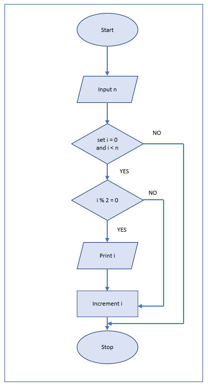

# Programming Fundamentals

## Algorithm and Pseudocode

Programming is the representation of logic. A program contains a set of instructions that are implemented in our software applications.

Software applications are designed to solve problems and to make our life easier. The most basic example can be a calculator, one can be fast in calculations but it is redundant to expect a human to work all the time to perform the calculation when it can be done easily using a program.

To solve a problem an approach is necessary. An algorithm is a procedure for solving problems. It contains information about actions to be performed and the order in which are executed.

Before even starting code a programmer can come up with the algorithm using informal language. For example, if a person's age is above or equal to 18, they are eligible to vote. The informal approach is

```
IF the age is greater than or equal to 18 THEN
     Print " Eligible to vote"
ELSE
     Print "Not Eligible to vote"
```

This approach of using informal language to develop algorithms is called Pseudocode. Pseudo means fake so Pseducode translates to fake code written in a form that humans can easily understand.

The difference between humans and computers is that computers are very rigid and even a small mistake or deviation will not give the desired results. Even in high-level programming languages like Java, Python, Java-Script and C/C++ etc, the programmer should follow the syntax. When someone starts will programming it's easy to start with pseudocode. Because in pseudocode one has the flexibility to create their own rules instead of following strict syntax rules like a semicolon, curly braces etc.

## Pseudocode Standards

Pseudocode standards are the constructs used to represent the basic actions performed in a program.

Every pseudocode starts with START/BEGIN and ends with END.

Before entering the constructs, one should know what are the common words used to represent basic actions in a program

Input: READ, OBTAIN, GET
Output: PRINT, DISPLAY, SHOW
Compute: COMPUTE, CALCULATE, DETERMINE
Initialize: SET, INIT
Add one: INCREMENT, BUMP

These are not fixed words but it is suggested to use them so that everyone can understand the pseudocode easily.

1. Sequence: One task is performed after another task in a linear progression.

Example: 

Consider a program to take input of two numbers and print the sum.

```
START
READ a
READ b
sum = a+b
Print sum
END
```
In the above statement, lines 2,3 and 4 are sequence statements.

2. IF-THEN-ELSE: It is used to choose a course of action based on a condition. In programming languages, we have similar syntaxes `if` and `else`.

```
IF condition THEN
    Sequence
ELSE
    Sequence
END IF
```

Example: 

A student will pass the examination if the score is above 60.

```
START
IF marks are greater than or equal to 60 THEN
     Print "PASSED"
ELSE 
     Print "Failed"
END IF

END
```
3. CASE: It is used to execute sequences based on conditions. All the conditions are mutually exclusive. In programming languages, we have a similar syntax for `switch`.

```
CASE expression OF
   condition 1: sequence 1
   condition 2: sequence 2
   .
   .
   .
   condition n: sequence n
OTHERS:
   default sequence
END CASE
```

Example: Print the grade for the given exam score.

```
START
CASE score of:
    greater than or equal to 90: PRINT "A"
    greater than or equal to 80 and less than 90: "B"
    greater than or equal to 70 and less than 80: "C"
    greater than or equal to 60 and less than 70: "D"
    less than 60: "F"
OTHERS
   PRINT "Please enter the score in the range 0 to 100 "
END CASE  
```
4. Loop: It is used to execute a sequence multiple times until a condition fails.

- WHILE: It is used to specify a loop with a condition at the top. In programming languages, we `while` loop similar to this.
  
Example:
  
To print the sum of natural numbers from 1 to n:

```
START
READ n
WHILE n greater than 0
    sum = sum + n
    DECREMENT n
END WHILE
PRINT sum
END
```

- FOR: It is used to create a loop for iterating the sequence a specific number of times. It is also called a counting loop. In programming languages we `for` loop similar to this.

Example:

Print the numbers in the range 1 to n.

```
START
READ n
FOR i=1 to n
   PRINT n
END FOR
END
```

- REPEAT-UNTIL: It is similar to a while loop but the condition is placed at the bottom of the loop. In programming languages, we `do while` loop similar to this.

Example: A program to print the sum of numbers in the range 1 to n.

```
START
READ n
REPEAT
  sum= sum + n
  DECREMENT n
UNTIL n is equal to zero
END
```
5. Nested constructs: The constructs can be embedded within each other in a program

Example: Print even numbers in the range 1 to n

```
START
READ n
FOR i= 1 to n:
  IF i mod 2 is equal to 0
      PRINT i
  END IF
END FOR
END
```

6. FUNCTION: In programming, every task is written as a function. A function can be called multiple times in a program. To put it simply function is a reusable block of code.

Example: Print product of two numbers

```
Function print product
    READ a
    READ b
    product = a*b
    PRINT product
END FUNCTION
```

7. PROGRAM: All the functions are wrapped under a program to improve readability.

```
PROGRAM name
  FUNCTION f1
  FUNCTION f2
  FUNCTION f3
  .
  .
  .
  FUNCTION fn
END
```

8. Exception handling: An exception is an event that disrupts the normal flow of the program. When an exception occurs in a program a block of code is executed in response to the exception.

```
START
  statements
EXCEPTION
    WHEN exception type
        statements to handle exceptions
    WHEN exception type
        statements to handle exceptions
END
```

There are no rules for writing a pseudocode. It is meant to be human-readable and it should convey the right meaning.

## Flow Chart

The flow chart is a diagram that represents an algorithm. In the flow chart, different shapes/boxes are used to represent different statements in a program and all the shapes/boxes are connected in the order of program execution.


Example: A program to print even numbers in the range 1 to n.



## Basic Programming Concepts

Every programming language has some common concepts which are necessary to execute a program and get the desired output.

### Variables

A variable is an entity that contains a value. The value can be a Number, Decimal, Character and String. As the name implies variables are not fixed and a new value can be stored anytime in the program. The naming convention for variables is camel case. in camel case the first letter is small and as words are added they are capitalized.

Examples:

```
age = 18
userName = "Michel Scott"
grade = 'A'
percentage = 94.9
```

As mentioned in the example numbers and decimals are written without any quotes Strings are embedded in double quotes and characters are embedded in single quotes.

<i><b>Note:</b>A programming language also contains constants that are fixed values</i>

### Function and Method

**Function:** A function is a reusable code. It can take the input and operate on the input and return data. It is the concept of functional programming language

**Method:** A method works similarly to a function. The difference is a method is associated with the instance of an object. It is related to object-oriented programming.

The naming convention for functions and methods is the camel case.

### Class

A class is a template of methods and variables. The naming convention for the class is Pascal case. Every word in the name is capitalized.

### Operators

### Arthamatic

| Symbol | Operator       | Usage | Explanation                                                                  |
| ------ | -------------- | ----- | ---------------------------------------------------------------------------- |
| +      | Addition       | a+b   | Adds the values on either side of the operator                               |
| \-     | Subtraction    | a-b   | Subtracts the right-hand value from the left-hand value                      |
| \*     | Multiplication | a\*b  | Multiplies the values on either side of the operator                         |
| /      | Division       | a/b   | Divides the left-hand value to the righthand value                           |
| %      | Modulus        | a%b   | Divides the left-hand value to the righthand value and returns the remainder |


### Relational

These operators are used for comparison and they return either true or false based on the result.

| Symbol | Operator              | Usage | Explanation                                                                                    |
| ------ | --------------------- | ----- | ---------------------------------------------------------------------------------------------- |
| \==    | equal                 | a==b  | If two operands are equal returns true, else returns false                                     |
| !=     | not equal             | a!=b  | If two operands are not equal returns true, else returns false                                 |
| \>     | greater than          | a>b   | If the left operand is greater than the right operand returns true,  else returns false                |
| <      | less than             | a<b   | if the left operand is less than the right operand returns true, else returns false                    |
| \>=    | greater than or equal | a>=b  | If the left operand is greater than or equal to the right operand returns true, else returns false |
| <=     | less than or equal    | a<=b  | If the left operand is less than or equal to the right operand returns true,  else returns false   |

### Assignment

| Symbol | Operator                | Usage | Explanation                                       |
| ------ | ----------------------- | ----- | ------------------------------------------------- |
| \=     | assignment              | a=b   | Assigns b right operand value to the left operand |
| +=     | add and assignent       | a+=b  | Implies a=a+b                                     |
| \-=    | subtract and assignment | a-=b  | Implies a=a-b                                     |
| \*=    | multiply and assignment | a\*=b | Implies a=a\*b                                    |
| /=     | divide and assignment   | a/=b  | Implies a=a/b                                     |
| %=     | modulus and assignment  | a%=b  | Implies a=a%b                                     |

### Logical

These values take the boolean value as input and return true or false as output.

| Symbol | Operator    | Usage | Explanation                                                                                          |
| ------ | ----------- | ----- | ---------------------------------------------------------------------------------------------------- |
| &&     | logical and | a&&b  | If conditions a and b are true it returns true. If either of the condition is false it returns false |
| &#124;&#124;  | logical or  | a&#124;&#124;b | If conditions a or b are true it returns true. If either of the condition is false it returns false  |
| !      | logical not | !a    | If a is true returns false and if a is false returns true                                            |

### Increment/Decrement

| Operator       | Usage | Explanation                              |
| -------------- | ----- | ---------------------------------------- |
| pre-increment  | ++a   | Increments a by 1 before using the value |
| post increment | a++   | Increments a by 1 after using the value  |
| pre decrement  | \--a  | Decrements a by 1 before using the value |
| post decrement | a--   | Decrements a by 1 after using the value  |

### Bitwise
A bit is the smallest unit of data in the computer system. It has a single value `0` or `1` called binary value. Bitwise operators compare two-bit patterns and return the binary value. 

1. `&`: `AND` copies 1 if both bits in the same position of a bit pattern are 1. Copies 0 if either of the bits in both patterns is 0.

| Input bit one | Input bit two | Result |
| ------------- | ------------- | ------ |
| 1             | 1             | 1      |
| 1             | 0             | 0      |
| 0             | 1             | 0      |
| 0             | 0             | 0      |


2. `|`: `OR` copies 1 if either of the bits in the same position in both patterns is 1. Copies 0 if both bits are 0.

| Input bit one | Input bit two | Result |
| ------------- | ------------- | ------ |
| 1             | 1             | 1      |
| 1             | 0             | 1      |
| 0             | 1             | 1      |
| 0             | 0             | 0      |


3. `^`: `XOR` copies the bit that is present in both bit patterns else copies 1.

| Input bit one | Input bit two | Result |
| ------------- | ------------- | ------ |
| 1             | 1             | 0      |
| 1             | 0             | 1      |
| 0             | 1             | 1      |
| 0             | 0             | 0      |


4. `~`: `NOT` Flips 0 to 1 and 1 to 0.

5. `<<`: Consider a<<b, a's value is moved left by the number of bits specified by the b. It is equivalent to multiplying a by 2<sup>b</sup>


6. `>>`: Consider a>>b, the value of a is moved right by the number of bits specified by the b. It is equivalent to dividing a by 2<sup>b</sup>
   
