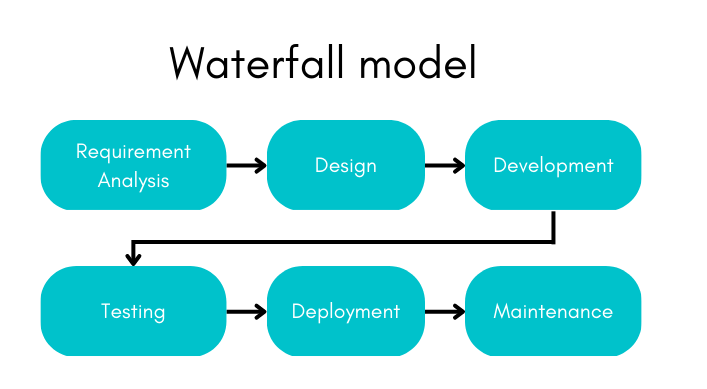

   
# SDLC and Agile Fundamentals
   
 ## Introduction to SDLC

Let’s start introducing you to SDLC with a packet of Biscuits. Yes, you heard that right. As we have a biscuit, we tend to wonder how it is being manufactured. What are the stages in the manufacturing process and that's what we are going to dive deep into. 

Firstly, there will be ingredient preparation stage, which includes measuring and mixing the ingredients (flour, sugar, butter, eggs, etc.)
Then, Dough making process, where the preapred ingredients are mixed together to form a dough.
Then, Dough shaping and cutting process, where the dough is shaped into the desired biscuit shape and cut into individual biscuits.
Then, Baking stage, where the biscuits are baked in an oven until they are golden brown.
Finally, Cooling and packing stage, where the biscuits are cooled and then packed for distribution and sale.

And this is how, we receive our biscuit packet and we enjoy having it. Don't we? 
Similarly, we have different stages involved in building software applications, just like our biscuits and we call them SDLC or Software Development Life Cycle.

SDLC is a business practice to analyze and improve the software development process as it helps increase the efficiency and quality of the product as well as meet the customer expectations.

## Overview of Software Development Life Cycle 
Organizations use a certain process to provide structure to their employees. This process provides an effective plan for various activities and it’s also applicable in software development life cycle (SDLC).
Various people in the org uses SDLC such as business analysts, developers, software engineers. It’s useful as it helps create effective structure, innovate products, and helps collaborate across various development stages.

## The 7 stages of SDLC:
 
### Planning
In this phase, the primary task is to clearly define the scope and objective of the software application. They also define the resources and material expenses needed and set limits to prevent the project from deviating from its initial objective.\
For example, collecting requirements to build a software application like teams, google meet.

### Define Requirements
In the design phase, the team models the way a software application will work. The inputs needed to develop the project are also defined as requirements.\
For example, a video player application would require the ability to display any videos or movies.

### Design & Prototyping
In this design and prototyping phase, the team simulates the way a software application will function.
Some stages of design include architecture, user interface, platforms, programming language, communication with related assets, security of the program. \
For example, the design of any social media application is to connect and interact with friends.

### Software Development
This phase is responsible for developing the code to run the application. During this phase, the team uses a version control system to identify code modifications which will aid the development team.\
For example, development of WhatsApp application.

### Testing
The testing phase is crucial to identify and correct errors and bugs that can occur. These are documented and sent to developers to rebuild the code. They help in minimizing the faults and bugs noticed by end users and results in increased customer satisfaction.\
For example, testing payment portal linked to a website.

### Deployment
In the deployment phase, the software application is provided to the end users. This can be of two types, namely, manual, and automated deployment process.\
For example, a chatbot can be deployed to a website.

### Operations & Maintenance
In this phase, the software application is almost completed and ready to be used. \
For example: Beta version of Windows/MacOS application.

<!-- UL -->
## Advantages of SDLC
*	Increased visibility and collaboration to design and create software applications.
*	Reduced time and costs as requirements and functionality are prioritized.
*	Increased clarity about requirements and business prospects that end users will benefit.
*	Follows a defined path and framework to develop based on the product requirements. 

## Waterfall Model
In our biscuit manufacturing process, every stage waits for the previous stage to be completed. For example, you can't bake the dough without preparing and mixing the ingredients. Also, each stage does not involve themselves in other stages. 

For example, If we add a bit of salt by mistake, we never know until its produced, packed and eaten by us, only then we raise a compliant that the biscuit is salty, right? This is what waterfall model is all about. The biscuit is completely produced and sold to customer like us to know that it's salty.

Similarly, the Waterfall model follows a strict set of procedures where each stage directs to another in a sequential flow resulting in the conclusion just like a waterfall. These stages consist of documenting the requirements, designing the prototype, code development, code testing, deployment, and maintenance of the application.
They also have a few drawbacks like lack of feedback and progress visibility, inflexibility to modify project scope or requirements once development has begun.

<!-- Images -->

## Agile Model
Now let's assume our biscuit manufacturing company introduces agile model, so in every stage there will be members who are responsible to check their respective stage and provide the best quality to the next stage and they are also responsible to acquire and send feedback if in case the outcome of the previous stage is not up to the expectation set by the team. 

For example, after the dough making process, the dough turns out to be black, the dough shaping and cutting team can provide the feedback to the dough making team and send the dough back for correction. This cycle is repeated until the cooling and packing team is satisfied with the biscuit's quality, and the it is sent to the customers. In this way, it can save lot of time as well as produce high quality biscuits for the customers.

In Agile methodology, teams work in short iterations called sprints, usually 2-4 weeks, where the team commits to delivering a specific set of features. The team holds daily stand-up meetings, called Scrums, to track progress and remove any obstacles. The team also has regular meetings, called Retrospectives, to review the previous sprint and plan for the next one.

<!-- Images -->

The Agile methodology is a flexible approach that allows teams to adapt to changing requirements and deliver working software quickly. It emphasizes collaboration, communication, and continuous improvement, which makes it well-suited for fast-paced, dynamic environments.

## Iterative Model
An iterative model is a type of model that uses an iterative process to improve its performance. This can involve repeatedly adjusting the model's parameters based on new data or feedback, in order to gradually improve its accuracy or performance. Let's not confuse ourselves with the definition as agile model follows iterative model.

### Agile related terms and tools

* __Scrum:__ It is a framework for managing and completing complex projects. It is an Agile methodology that is commonly used in software development and IT projects, but can be applied to any project.\
* __Sprint:__ The goal of a sprint is to deliver a potentially releasable product increment, which means that the team should aim to deliver a working version of the product that meets the requirements of the product backlog items selected for the sprint.\
* __Velocity:__ It is a measure of how much work a team can accomplish during a sprint or a set period of time. It is typically measured in story points, which are a relative measure of the size and complexity of a piece of work. Velocity is used to predict how much work a team can accomplish in future sprints, and to help plan and prioritize work.
* __Agile tools:__ Most commonly used agile tools are Jira, Trello, Microsoft Azure DevOps. The best tool for a specific team or project will depend on the specific needs and requirements.

## Story pointing:
Story pointing is a method used in Agile development to estimate the relative size and complexity of a user story, or a functional requirement for a product. The goal of story pointing is to provide a consistent, standardized way for the development team to understand the scope of a user story and to plan and prioritize the work for a sprint or release.

## Agile frameworks:
The most widely used agile frameworks are,

### 1.	Scrum
-	Supports incremental delivery
-	Self-organizing teams
-	1–4-week quick sprints
-	Cross-functional and iterative in nature

### 2.	Kanban

-	Supports continuous delivery
-	Less focused on roles and events
-	More focused on workflow rather than sprints
-	Favors continuous task movement

## Key Roles and Responsibilities:
In Agile development, there are several key roles and responsibilities that are typically defined. These include:

* __Product Owner:__ responsible for defining and prioritizing the features and requirements of the product being developed
* __Scrum Master:__ acts as a facilitator for the development team, helping to remove any obstacles that may be impeding progress
* __Development Team:__ responsible for building and delivering the product

In addition to these core roles, there may also be other roles defined in an Agile development process, such as stakeholders, QA, and project managers. The specific responsibilities for each role will vary depending on the organization and the project at hand.

<!-- Strong -->
## Scrum ceremonies:
In Scrum, there are several ceremonies that are held regularly to keep the development process on track and ensure that the team is working together effectively. These ceremonies include:

* __Sprint Planning:__ a meeting held at the beginning of each sprint to plan the work that will be completed during the sprint.
* __Daily Scrum:__ a short meeting held each day to review progress and plan for the next 24 hours of work.
* __Sprint Review:__ a meeting held at the end of each sprint to review the work completed during the sprint, and to gather feedback from stakeholders.
* __Sprint Retrospective:__ a meeting held at the end of each sprint to reflect on the past sprint and identify ways to improve the process for the next sprint.
* __Backlog Refinement:__ a meeting held periodically to review and prioritize the product backlog, ensuring that the items at the top of the backlog are ready for development in the next sprint.
