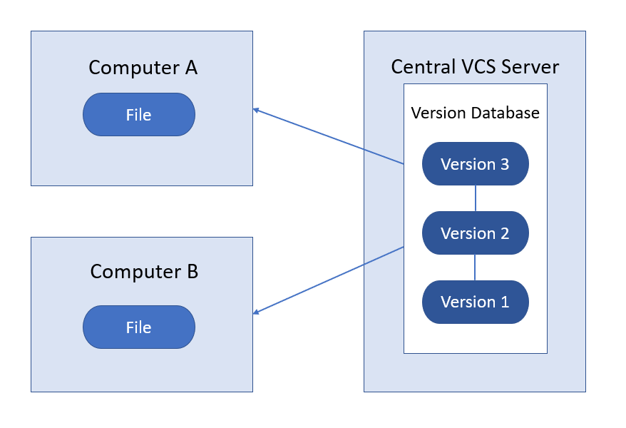
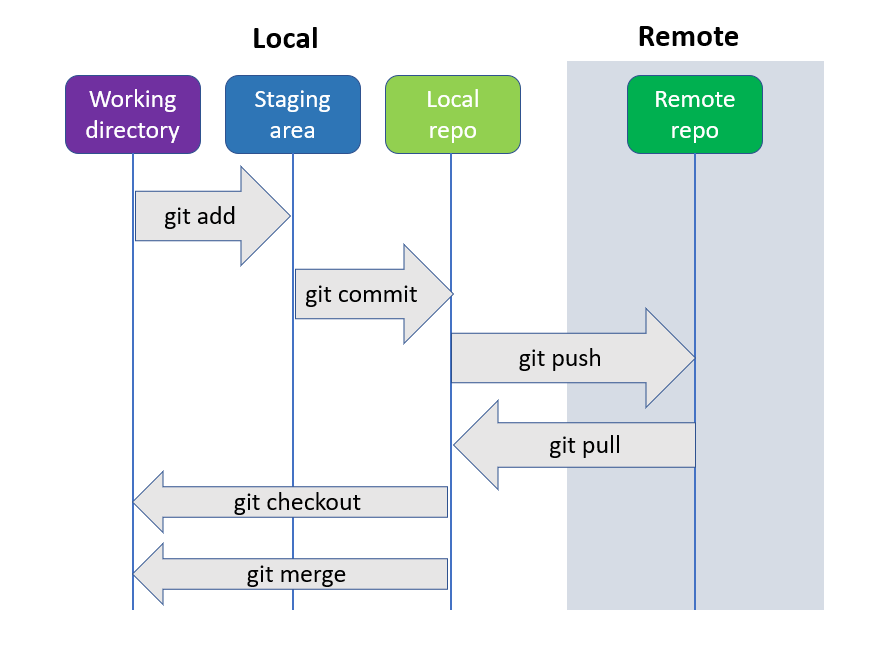

# Git
## Versioning

Consider that you are working on an essay for school. Initially, you will create a draft and save it in your system, now after completing the initial draft you made some changes like adding new information, deleting irrelevant information and correcting grammatical errors in the file. After making all these changes you will save the document using save as and save it as draft 2. You might be thinking why should I replace the draft one with the updated draft?

The reason might be that the verbose in the initial draft might be better or the information that you deleted might be important. So it's better to save the file as draft two.  Now consider it is a folder with multiple files, It becomes complex to store multiple drafts of all the files in the folder, Now consider that it's a group assignment and multiple people are working on the same files. Now it becomes even more complex.  After a while, it becomes hard to figure out which file contains what information and what changes were made.

The drafts can be correlated to updates in software development. As the number of updates grows, it becomes hard to classify and manage all the updates. On top of that the real-life development process includes collaboration. When multiple people work on the same project consisting of multiple files, it will lead to the following issues will arise:

1. Storage: All the files created for all changes will take up more storage.
2. Tracking: multiple changes made by multiple collaborators should be tracked.
3. Maintenance: The changes if not tested properly may break the application and if that happens the application must revert to its recent stable version.
4. Security: Not everyone should be allowed to make changes to the application.

To solve all the above problems and to add some additional functionalities version control system is used.

## Version Control System

Version control systems are classified into two types.

Centralized
Distributed

Consider a scenario where one of your friends has a board game and to play that game, all the friends can access it from that specific friend. This is an example of centralized VCS and now consider that a group of friends are playing an online game. Instead of gathering at a single place all the friends can connect and play from their homes. This is an example of distributed VCS.

To put it in technical terms, centralized VSC has a single central copy of the project and programmers will access and commit their changes from that copy. This arrangement is not preferred because if the central server fails, the entire project fails. A few examples of centralized VCS are  CVS Preforce and subversion.



In distributed VCS the codebase maintained in the server is copied to every individual developer's system. Even though a single user loses the data or a failure occurs in a single system, the code is preserved. A few examples of distributed VCS are GIT and Mercurial.


for additional information refer to [git version contol](https://git-scm.com/book/en/v2/Getting-Started-About-Version-Control)

## Git

As explained GIT is a free and open-source distributed version control system. It is used to handle small to large projects with speed and efficiency.

To install GIT refer to [git download](https://git-scm.com/downloads).

Once the installation procedure is completed, to check if GIT is installed in your system run the following command in the command prompt(windows) or terminal in case of mac os or Linux.

```
 git --version
```

If git is installed, the output should be the git version installed in your system.

GIT can be accessed using the command line, IDE and GUI.  In this document, we will use the command line tool GIT bash and VisualStudioCode IDE (VS code)

To download VS code refer to [VS Code Download](https://code.visualstudio.com/download)

Open Git bash. The following are the initial settings to be configured:

1. Name
2. Email
3. Default Editor 


### git config

Git config is used to configure the options line name, email etc.


Step 1: To configure the name run the following command with your user name

```
git config --global user.name "user name"
```

<i><b>Note: user name is entered in double quotes because the user name may contain space.  </b></i>

Step 2: To configure the email run the following command with your email.


```
git config --global user.email user email
```


Step 3: The core editor is used to edit the configuration settings. Compared to the git bash VS code has better UI and is easy to use. To set VS Code as the core editor run the following command in git bash.

```
git config --global core.editor "code  --wait"
```

- code is the bin location of VS code saved in your system. `code` is configured in your system when VS code is installed.
- `--wait` ensures that no action can be performed in git bash when VS code is opened for editing the git files.

Step 4: To open the core editor run the following command

```
git config --gloabl -e
```

### Scopes

`--global` represents the scope of the git configuration. Git has the following scopes:

1. `--global`: The configuration set using global scope sets the non-default behaviour for all the repositories of a specific user.
2. `--system`: The configuration set using system scope sets the non-default behaviour for every user of the system and all their repositories.
3. `--local`: The configuration set using system scope sets the non-default behaviour for that specific repository.

### Git bash workflow



**Working directory**: It represents the files and folders in your local system.

**Staging:** Staging is an intermediate area between local files and the repository. The staging is used to check all the changes made and only the necessary changes are committed to the repository.

**Repository:** GIT repository is the collection of all the files of projects of the versions. The local repository is the repository initialized in the local system. remote repository is the repository created in Git Hub, Git labs etc.

## Basic git concepts

### git help

If you get stuck anywhere in git or if you need any information about any git command `git help` provides detailed information about git commands. Run the following command

```
git command-name --help
```

To get the short description run the following command

```
git command-name --h
```

### Creating a Git repository

Step 1: Create a folder in your system dedicated to the git repository.

```
mkdir name
```

Step 2: Navigate to that directory

```
cd directory-name
```

Step 3: To initialise the repository enter the following command.

```
git init
```

- Once the repository is initialised `.git` file is created and it contains all the important information like git objects, hooks, HEAD and logs etc.
- `.git` file should not be edited because it might break the repository.
- Normally `.git` file is hidden to avoid editing.


### git add

Git add is used to add the the changes of working directory to the staging area. 

```
git add filename
```
To add multiple files that have the same extension the following command is used

```
git add *.extention
```

the extension can be `txt` for text files, `java` for java files etc.

For recursively adding all changes to all files the following command is used

```
git add .
```

It's better to avoid `git add .` because a project contains huge files and it's not suggested to recursively add those files to the staging area.
<br>
To remove files from the staging area the following command is used.

```
git restore --staged file name
```

### git stash

`git statsh` is used to save all the stagged and unstaged changes. These changes can be omitted for commits until they are re-applied using `stash pop`. 

For better understanding stash is like a bucket in which all the changes are staked on top of each other. When `git statsh` is used all the changes are stacked and saved in the bucket and with ``stash pop` the changes are brought to back from the bucket. another alternative is ` stash apply`. Using this the changes are saved in the stash and also applied to the working directory and staging area.


### git commit

Git commit is used to save the changes to the local repository. The following command is run to commit the changes

```
git commit -m "message"
```

Git commit contains the following information:

1. Id: A unique SHA1 value will be generated automatically to uniquely identify the commit.
2. Message: The message entered to describe the changes
3. Data/time
4. Author: the user name and user email configured in git.
5. Complete snapshot of the project.


### .gitignore

Once the git repository is initialised it tracks all the files. Even though the files are not stagged they are tracked. Some files like user log files do not have to b tracked and added to the staging area. Those files can be added to `.gitignore`

To add a file to `.gitignore` enter the following command.

```
echo "file name">> .gitignore
```

<i><b>Note:</b> Once the files are stagged they will not be ignored if they are added to <code>.gitignore</code>. the staged files should be unstaged to ignore.</i>

### git status

Git status gives the state of the working directory and the staging area. Information about the current branch, staged changes and unstaged changes are displayed using git status. Run the following command

```
git status
```

To get short status run the following command

```
git status -s
```

### git diff

To view the changes made in the working directory and staging area `git diff` is used.

To view the stagged changes run the following command
```
git diff --staged
```

To view, unstaged changes run the following command.

```
git diff
```

### git log

To get the history of all the commits `git log` is used. Run the following command to get the history

```
git log
```

to get a oneline description of commits run the following command

```
git log --oneline
```

<i><b>Note</b> <code>git log</code> lists out the information of all the commits starting from the most recent commit. To get information in initial to the most recent <code>git log --reverse</code> can be used.</i>

### Creating a remote repository

Create a git hub account using the link [git hub](https://github.com/).
Once the account is created, to create a new repository refer to [git repository creation](https://docs.github.com/en/repositories/creating-and-managing-repositories/creating-a-new-repository)

### git clone

`git clone` is used to create a copy of the existing repository. It can be a remote repository or a local repository. To create a copy of a remote repository, copy the repository link(HTTP or SSH) from the remote repository and run the following command.

```
git clone repository-link
```

for additional information refer to [git hub clone](https://docs.github.com/en/repositories/creating-and-managing-repositories/cloning-a-repository)

### remote add

The `git remote add` command will create a new connection record to a remote repository.

the following command is run to add connect a remote git repository

```
git remote add origin repository-link
```

For additional information refer to [git remote add](https://docs.github.com/en/get-started/getting-started-with-git/managing-remote-repositories)


### git fetch

git fetch is used to download the contents from the remote repository.

```
git fetch
```

### git merge

git merge is used to merge the changes in the remote repository to the local repository. git merge is also used to integrate changes from another branch to the current branch.

### git pull

git pull is a combination of git fetch and git merge. All the remote changes are downloaded and merged with the local repository. In case of any conflicts, git merge will not be implemented.

```
git pull
```

### git push

git push is used to upload the local repository content to the remote repository. After committing all the changes the following command is implemented to push the changes to the remote repository.

```
git push
```

### git branch and git checkout

A branch is an independent line of development in git.


In every project, there is a main/master branch. It is the initial branch created along with the git repository. In git workflow, a develop or dev branch is used to protect the information in the main branch. Along with main and dev branches, feature branches are created by users to work on the project. Feature branches are branched from dev branches and all the changes made by feature branches are incorporated into the main branch via the dev branch but never directly to the main branch. 


To create a branch run the following command

```
git branch branch-name
```

To create a dev branch `git branch dev` command is run. Feature branches are created from the dev branch, to create a branch from a specific branch the following command is used.

```
git branch branch-name from-branch
```
To create a feature branch `git branch feature dev` command is run.

`git checkout` is used to navigate between the git branches. The following command is used to checkout to a specific branch.

```
git checkout branch-name
```

For additional information about git commands refer to [git commands](https://git-scm.com/docs)
