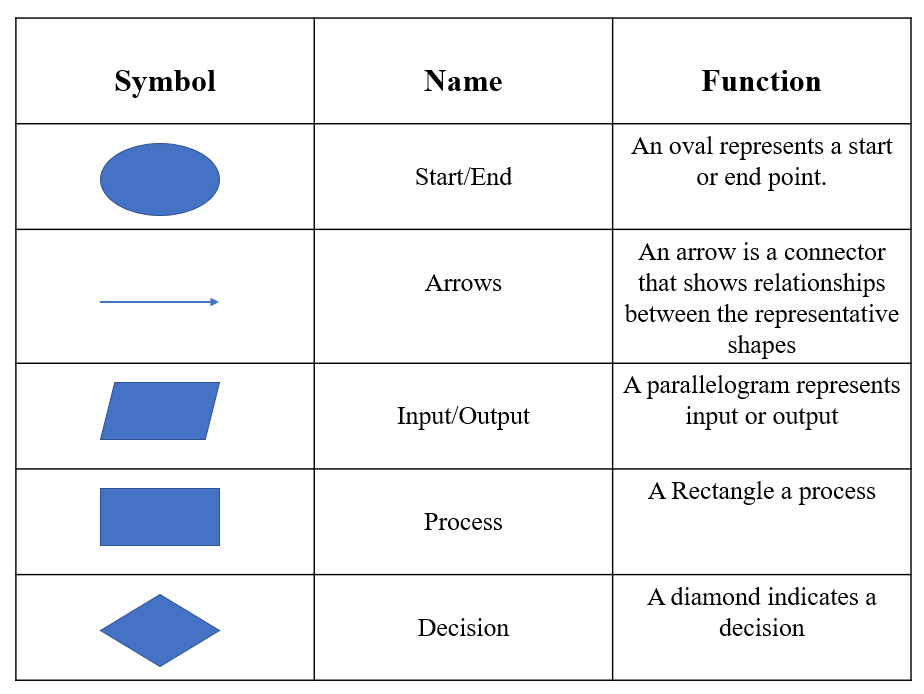

# Programming Fundamentals

## Programming
In basic terms, programming is the process of creating a set of instructions that instructs the computer to perform a task.
Consider an example where you input two values and want to find the sum of the two input values. 
In this program, you are asked to enter two values. The two values are stored in variables `value1` and `value2`. Then, these two values are added using the `+` operator and the result is stored in the `result` variable.

```java
result = value1 + value2;
System.out.println(result);
```

Then, the result is displayed.

## Programmer
In basic terms, a programmer is defined as the person who builds the program to run and execute a specific task.

## Machine language
As humans, we are equipped with the ability to learn multiple languages. Sadly, computers don't hlave that ability. They are designed in a way to read 0s and 1s. Yes, you are right. Computers convert everything we say into 0s and 1s and that's what we call as machine language. But imagine telling a computer to design a website just by inputing 0s and 1s. It's impossible for a human to do that, right? So, we designed several highly programmer friendly languages which can be converted in such a way that the computer can understand. How do they convert? We will be covering them shortly.
  


In this story, a machine language is described as a\ language understood by a computer. It is very difficult to understand for humans, but it is the only thing that the computer can work with. All programs and programming languages eventually gets converted and runs in machine language.  

## Programming language
Now, how do the same programmer develop  and execute a specified task. He or she needs to communicate with the computer who doesn't speak our human language. So, instead of computer learning English. It's humans who have to learn the computer language, which is also called the programming language.

In this story, a programming language is described as a specific language in which a programmer is expected to solve a specific task.

## High-level to machine level conversion
A high-level programming language is a programming language that is designed to be easily understood and used by humans. It is high-level because it is closer to human language and abstracts away many of the details of the underlying hardware. Examples of high-level languages include Python, Java, C++, and C#.

Machine language, on the other hand, is a low-level programming language that is executed directly by the computer's hardware. It consists of binary code, which is a series of 0s and 1s that the computer's processor can understand.


To convert a program written in a high-level language to machine language, a compiler or interpreter is used. We will discuss them in the next unit.

It's important to note that high-level programming languages have many features that makes development faster and more efficient, but the final code executed by the computer is always in a machine level language.
  
## Compiler
  
In our scenario, our programmer who has the knowledge of creating a website using a programming language, creates a program in an environment which includes a compiler. It's the compiler's job to convert a human readable code to machine readable code for the computer to run the program.
  


In this story, A compiler is a program that takes the source code written in a high-level language and converts it into machine code. This machine code can then be executed directly by the computer's processor.
  
## Interpreter
  
If compiler can convert the high level language to machine level language. What is the role of interpreter? To understand it, we need to analyze why there is need for compiler and interpreter. 
A compiled program runs faster than an interpreted program but interpreter directly runs and executes the high level language without converting into machine level language.
  

 
While some prefer compiler over interpreter for its efficiency and faster execution, it's has a specific target and cannot be used cross-platform. To solve this portability issue, interpreter is used.
  
In this story, An interpreter runs and executes the high-level code directly line by line, instead of converting it to machine language first.

## Programming structure
The next thing a programmer has to work on is the programming structure which is also described as the program layout. This can include things like indentation, commenting, and the use of functions and modules.
 
A well-structured program is easy to read, understand and modify, while a poorly structured program can be difficult to work with. Good programming practices, such as using meaningful variable names and commenting, can also contribute to the overall structure of a program.

## Programming logic
Along with the program structure, the programmer needs to crack the problem logic to get the desired output or result, in this case, he/she needs to provide the right programming logic to build the website based on the user's needs.

In this story, programming logic can be described as a set of principles that aligns the elements in a way for the computer to perform required tasks.

## Procedural programming
Let's consider a different scenario. As a customer support for a regional bank, I want to be able to input a customer's account information to withdraw or deposit money from their account, so that I can properly assist customer with their financial transactions. This can be accomplished using a procedural programming approach, in which the program is broken down into a series of specific steps or procedures that are executed in a specific order.

## Functional programming
   
A functional programming user story is a way to describe a specific feature or functionality that a software program should have, using the principles of functional programming. 
For example,
As a user, I want to be able to add two numbers together, so that I can perform basic math calculations.
Input: 2 numbers
Output: The sum of the 2 numbers.  


   
   
In this story, It includes a description of the problem that the program is meant to solve, as well as the specific inputs and outputs that the program should have. 

## Object-oriented programming
Now that we have seen programs that are processed based on functions and procedures, we also have programs that runs based on objects. Yes, they are more detail oriented and helps in data security and integrity. 
 
In programming world, we define it as a paradigm that is based on the concept of "objects", which are self-contained units of data and functionality. In OOP, objects are created from classes, which define their properties and methods. Objects can interact with each other by sending messages (method calls) and can change their internal state as a result.
 
OOP is commonly used in many programming languages like Java, C++, Python, C#, etc. OOP is useful for modeling real-world objects and systems, and for creating reusable and maintainable code.
   
### Abstraction
   

   
Imagine a scenario where we all use an ATM machine for cash withdrawal, money transfer, retrieve min-statement, etc in our daily life. But we don't know internally what things are happening inside ATM machine when you insert ATM card for performing any kind of operations. This is a child-level explanation to what abstraction is.
   
In other words, Abstraction is a technique by which we can hide the data that is not required to a user.
   
There are 2 ways to achieve abstraction in java. They are as follows:
1. Abstract class (0 to 100%)
2. Interface (100%)

Advantages
1. It reduces the complexity of code readability.
2. It removes code duplication and enhances reusability.
3. It helps to improve security of an application or program as only important details are provided to the user.
4. Abstract method can be implemented to perform different tasks depending on the needs.
   
### Encapsulation
For the same ATM machine, can we break open the machine just like that? No. The protective shield-like machine that prevents the money from being stolen is what we call as Encapsulation. It is defined as wrapping up of data into a signle unit which in this case data refers to the money inside the ATM machine.
   
Encapsulation can be achieved in the following ways.

1. Declaring the instance variable of the class as private, so that, it can't be accessed directly from outside the class.
2. Assign the public setter and getter methods in the class to modify the values of the variables.

Advantages
1. The encapsulated code is more coherent and easy to change with latest demands.
2. It prevents the other classes to gain access of private components.
3. It enhances the maintainability of the application.
4. It helps in achieving security.   
   
### Inheritance
Let's suppose the bank wants to open a new ATM branch and set up a new ATM machine. It's easier to inherit the existing code and implementing in the new machine. In this way we can be more quick and efficient.
In other words, Inheritance is the mechanism by which an object acquires the some/all properties of another object.

Why use Inheritance?

1. For Method Overriding (so runtime polymorphism can be achieved).
2. For Code Reusability.
   
Types of Inheritance:
   1. Single inheritance
   2. Multiple inheritance
   3. Multi-level inheritance
   4. Hierarchical Inheritance
   5. Hybrid Inheritance

### Polymorphism
To continue with our scenario, we can perform multiple operations on an ATM machine like cash withdrawal, cash deposit, PIN generation, Balance check, etc. It refers to the ability of an entity to perform multiple tasks while having the same name.
   
Polymorphism is of two types:
   1. Compile-time polymorphism (Method Overloading): When there are multiple functions with same name but different parameters then these functions are said to be overloaded. 
   2. Run-time polymorphism (Method Overriding): It occurs when a derived class has a definition for one of the member functions of the base class. That base function is said to be overridden.

## Top-down apporach vs Bottom-up approach
   
In our scenario, The top-down approach to management is a strategy in which the decision-making process occurs at the highest level and is then communicated to the rest of the team. This style can be applied at the project, team, or even the company level, and can be adjusted according to the particular group’s needs. 
   
When approaching project objectives from the bottom up, a team will collaborate across all levels to determine what steps need to be taken to achieve overall goals. The bottom-up approach is newer and more flexible than the more formal top-down strategy, which is why it’s more commonly found in industries where disruption and innovation are a priority. 
   
| Top-Down Apporach                                                      | Bottom-Up Approach                                                        |
|------------------------------------------------------------------------|---------------------------------------------------------------------------|
| It is decision driven                                                  | It is data driven                                                         |
| Focuses on functions                                                   | Focuses on data                                                           |
| Can contain redundancy as the problem is broken down into sub problems | Can contain less redundancy as data is hidden and secured                 |
| Mostly used by procedural programming languages like C, Fortran, etc.  | Mostly used by Object oriented programming languages like C++, Java, etc. |  
   
For more information, visit,
   1. https://developer.mozilla.org/en-US/docs/Learn/JavaScript/Objects/Object-oriented_programming
   2. https://docs.oracle.com/javase/tutorial/java/concepts/index.html

---
   
## Algorithm and Pseudocode

Programming is the representation of logic. A program contains a set of instructions that are implemented in our software applications.

Software applications are designed to solve problems and to make our life easier. The most basic example can be a calculator, one can be fast in calculations but it is redundant to expect a human to work all the time to perform the calculation when it can be done easily using a program.

To solve a problem an approach is necessary. An algorithm is a procedure for solving problems. It contains information about actions to be performed and the order in which are executed.

Before even starting code a programmer can come up with the algorithm using informal language. For example, if a person's age is above or equal to 18, they are eligible to vote. The informal approach is

```
IF the age is greater than or equal to 18 THEN
     Print " Eligible to vote"
ELSE
     Print "Not Eligible to vote"
```

This approach of using informal language to develop algorithms is called Pseudocode. Pseudo means fake so Pseducode translates to fake code written in a form that humans can easily understand.

The difference between humans and computers is that computers are very rigid and even a small mistake or deviation will not give the desired results. Even in high-level programming languages like Java, Python, Java-Script and C/C++ etc, the programmer should follow the syntax. When someone starts will programming it's easy to start with pseudocode. Because in pseudocode one has the flexibility to create their own rules instead of following strict syntax rules like a semicolon, curly braces etc.

## Pseudocode Standards

Pseudocode standards are the constructs used to represent the basic actions performed in a program.

Every pseudocode starts with START/BEGIN and ends with END.

Before entering the constructs, one should know what are the common words used to represent basic actions in a program

Input: READ, OBTAIN, GET
Output: PRINT, DISPLAY, SHOW
Compute: COMPUTE, CALCULATE, DETERMINE
Initialize: SET, INIT
Add one: INCREMENT, BUMP

These are not fixed words but it is suggested to use them so that everyone can understand the pseudocode easily.

1. Sequence: One task is performed after another task in a linear progression.

Example: 

Consider a program to take input of two numbers and print the sum.

```
START
READ a,b
sum = a+b
Print sum
END
```
In the above statement, lines 2,3 and 4 are sequence statements.

2. IF-THEN-ELSE: It is used to choose a course of action based on a condition. In programming languages, we have similar syntaxes `if` and `else`.

```
IF condition THEN
    Sequence
ELSE
    Sequence
END IF
```

Example: 

A student will pass the examination if the score is above 60.

```
START
IF marks are greater than or equal to 60 THEN
     Print "PASSED"
ELSE 
     Print "Failed"
END IF

END
```
3. CASE: It is used to execute sequences based on conditions. All the conditions are mutually exclusive. In programming languages, we have a similar syntax for `switch`.

```
CASE expression OF
   condition 1: sequence 1
   condition 2: sequence 2
   .
   .
   .
   condition n: sequence n
OTHERS:
   default sequence
END CASE
```

Example: Print the grade for the given exam score.

```
START
CASE score of:
    greater than or equal to 90: PRINT "A"
    greater than or equal to 80 and less than 90: "B"
    greater than or equal to 70 and less than 80: "C"
    greater than or equal to 60 and less than 70: "D"
    less than 60: "F"
OTHERS
   PRINT "Please enter the score in the range 0 to 100 "
END CASE  
```
4. Loop: It is used to execute a sequence multiple times until a condition fails.

- WHILE: It is used to specify a loop with a condition at the top. In programming languages, we `while` loop similar to this.
  
Example:
  
To print the sum of natural numbers from 1 to n:

```
START
READ n
WHILE n greater than 0
    sum = sum + n
    DECREMENT n
END WHILE
PRINT sum
END
```

- FOR: It is used to create a loop for iterating the sequence a specific number of times. It is also called a counting loop. In programming languages we `for` loop similar to this.

Example:

Print the numbers in the range 1 to n.

```
START
READ n

FOR i=1 to n
   PRINT n
END FOR
END
```

- REPEAT-UNTIL: It is similar to a while loop but the condition is placed at the bottom of the loop. In programming languages, we `do while` loop similar to this.

Example: A program to print the sum of numbers in the range 1 to n.

```
START
READ n
REPEAT
  sum= sum + n
  DECREMENT n
UNTIL n is equal to zero
END
```
5. Nested constructs: The constructs can be embedded within each other in a program

Example: Print even numbers in the range 1 to n

```
START
READ n
FOR i= 1 to n:
  IF i mod 2 is equal to 0
      PRINT i
  END IF
END FOR
END
```

6. FUNCTION: In programming, every task is written as a function. A function can be called multiple times in a program. To put it simply function is a reusable block of code.

Example: Print product of two numbers

```
Function print product
    READ a, b
    product = a*b
    PRINT product
END FUNCTION
```

7. PROGRAM: All the functions are wrapped under a program to improve readability.

```
PROGRAM name
  FUNCTION f1
  FUNCTION f2
  FUNCTION f3
  .
  .
  .
  FUNCTION fn
END
```

8. Exception handling: An exception is an event that disrupts the normal flow of the program. When an exception occurs in a program a block of code is executed in response to the exception.

```
START
  statements
EXCEPTION
    WHEN exception type
        statements to handle exceptions
    WHEN exception type
        statements to handle exceptions
END
```

There are no rules for writing a pseudocode. It is meant to be human-readable and it should convey the right meaning.

## Flow Chart

The flow chart is a diagram that represents an algorithm. In the flow chart, different shapes/boxes are used to represent different statements in a program and all the shapes/boxes are connected in the order of program execution.



Example: A program to print even numbers in the range 1 to n.


## Basic Programming Concepts

Every programming language has some common concepts which are necessary to execute a program and get the desired output.

### Variables

A variable is an entity that contains a value. The value can be a Number, Decimal, Character and String. As the name implies variables are not fixed and a new value can be stored anytime in the program. The naming convention for variables is camel case. in camel case the first letter is small and as words are added they are capitalized.

Examples:

```
age = 18
userName = "Michel Scott"
grade = 'A'
percentage = 94.9
```

As mentioned in the example numbers and decimals are written without any quotes Strings are embedded in double quotes and characters are embedded in single quotes.

<i><b>Note:</b>A programming language also contains constants that are fixed values</i>

### Function and Method

**Function:** A function is a reusable code. It can take the input and operate on the input and return data. It is the concept of functional programming language

**Method:** A method works similarly to a function. The difference is a method is associated with the instance of an object. It is related to object-oriented programming.

The naming convention for functions and methods is the camel case.

### Class

A class is a template of methods and variables. The naming convention for the class is Pascal case. Every word in the name is capitalized.

## Operators

### Arthamatic

| Symbol | Operator       | Usage | Explanation                                                                  |
| ------ | -------------- | ----- | ---------------------------------------------------------------------------- |
| +      | Addition       | a+b   | Adds the values on either side of the operator                               |
| \-     | Subtraction    | a-b   | Subtracts the right-hand value from the left-hand value                      |
| \*     | Multiplication | a\*b  | Multiplies the values on either side of the operator                         |
| /      | Division       | a/b   | Divides the left-hand value to the righthand value                           |
| %      | Modulus        | a%b   | Divides the left-hand value to the righthand value and returns the remainder |


### Relational

These operators are used for comparison and they return either true or false based on the result.

| Symbol | Operator              | Usage | Explanation                                                                                    |
| ------ | --------------------- | ----- | ---------------------------------------------------------------------------------------------- |
| \==    | equal                 | a==b  | If two operands are equal returns true, else returns false                                     |
| !=     | not equal             | a!=b  | If two operands are not equal returns true, else returns false                                 |
| \>     | greater than          | a>b   | If the left operand is greater than the right operand returns true,  else returns false                |
| <      | less than             | a<b   | if the left operand is less than the right operand returns true, else returns false                    |
| \>=    | greater than or equal | a>=b  | If the left operand is greater than or equal to the right operand returns true, else returns false |
| <=     | less than or equal    | a<=b  | If the left operand is less than or equal to the right operand returns true,  else returns false   |

### Assignment

| Symbol | Operator                | Usage | Explanation                                       |
| ------ | ----------------------- | ----- | ------------------------------------------------- |
| \=     | assignment              | a=b   | Assigns b right operand value to the left operand |
| +=     | add and assignent       | a+=b  | Implies a=a+b                                     |
| \-=    | subtract and assignment | a-=b  | Implies a=a-b                                     |
| \*=    | multiply and assignment | a\*=b | Implies a=a\*b                                    |
| /=     | divide and assignment   | a/=b  | Implies a=a/b                                     |
| %=     | modulus and assignment  | a%=b  | Implies a=a%b                                     |

### Logical

These values take the boolean value as input and return true or false as output.

| Symbol | Operator    | Usage | Explanation                                                                                          |
| ------ | ----------- | ----- | ---------------------------------------------------------------------------------------------------- |
| &&     | logical and | a&&b  | If conditions a and b are true it returns true. If either of the condition is false it returns false |
| ||     | logical or  | a||b  | If conditions a or b are true it returns true. If either of the condition is false it returns false  |
| !      | logical not | !a    | If a is true returns false and if a is false returns true                                            |

### Increment/Decrement

| Operator       | Usage | Explanation                              |
| -------------- | ----- | ---------------------------------------- |
| pre-increment  | ++a   | Increments a by 1 before using the value |
| post increment | a++   | Increments a by 1 after using the value  |
| pre decrement  | \--a  | Decrements a by 1 before using the value |
| post decrement | a--   | Decrements a by 1 after using the value  |

### Bitwise
A bit is the smallest unit of data in the computer system. It has a single value `0` or `1` called binary value. Bitwise operators compare two-bit patterns and return the binary value. 

1. `&`: `AND` copies 1 if both bits in the same position of a bit pattern are 1. Copies 0 if either of the bits in both patterns is 0.

| Input bit one | Input bit two | Result |
| ------------- | ------------- | ------ |
| 1             | 1             | 1      |
| 1             | 0             | 0      |
| 0             | 1             | 0      |
| 0             | 0             | 0      |


2. `|`: `OR` copies 1 if either of the bits in the same position in both patterns is 1. Copies 0 if both bits are 0.

| Input bit one | Input bit two | Result |
| ------------- | ------------- | ------ |
| 1             | 1             | 1      |
| 1             | 0             | 1      |
| 0             | 1             | 1      |
| 0             | 0             | 0      |


3. `^`: `XOR` copies the bit that is present in both bit patterns else copies 1.

| Input bit one | Input bit two | Result |
| ------------- | ------------- | ------ |
| 1             | 1             | 0      |
| 1             | 0             | 1      |
| 0             | 1             | 1      |
| 0             | 0             | 0      |


4. `~`: `NOT` Flips 0 to 1 and ` to 0.

5. `<<`: Consider a<<b, a's value is moved left by the number of bits specified by the b. It is equivalent to multiplying a by 2<sup>b</sup>


6. `>>`: Consider a>>b, the value of a is moved right by the number of bits specified by the b. It is equivalent to dividing a by 2<sup>b</sup>
   
 ---
   
# SDLC and Agile Fundamentals 
   
 ## Introduction to SDLC

Let’s start with our childhood days, as kids, we used to ask our parents for everything we see but almost all of them were not provided due to various reasons. So, we ask our parents for approval. Our parents then decide if it’s good or bad by considering lots of factors. Similarly, there are users who seek their manager’s approval to perform certain tasks for their project.

For Example,
As a user, I want to send my leave request to my manager.\
As a manager, He/ She accepts and sends to HR for their reference.\
As HR member, He/ She can either approve (as second authority) or just make a note of it.

Similarly, we have different stages involved in building software applications and we call them SDLC or Software Development Life Cycle.

SDLC is a business practice to analyze and improve the software development process as it helps increase the efficiency and quality of the product as well as meet the customer expectations.

## Overview of Software Development Life Cycle 
Organizations use a certain process to provide structure to their employees. This process provides an effective plan for various activities and it’s also applicable in software development life cycle (SDLC).
Various people in the org uses SDLC such as business analysts, developers, software engineers. It’s useful as it helps create effective structure, innovate products, and helps collaborate across various development stages.


## The 7 stages of SDLC:
 
### Planning
In this phase, the primary task is to clearly define the scope and objective of the software application. They also define the resources and material expenses needed and set limits to prevent the project from deviating from its initial objective.\
For example, collecting requirements to build a software application like teams, google meet.

### Define Requirements
In the design phase, the team models the way a software application will work. The inputs needed to develop the project are also defined as requirements.\
For example, a video player application would require the ability to display any videos or movies.

### Design & Prototyping
In this design and prototyping phase, the team simulates the way a software application will function.
Some stages of design include architecture, user interface, platforms, programming language, communication with related assets, security of the program. \
For example, the design of any social media application is to connect and interact with friends.

### Software Development
This phase is responsible for developing the code to run the application. During this phase, the team uses a version control system to identify code modifications which will aid the development team.\
For example, development of WhatsApp application.

### Testing
The testing phase is crucial to identify and correct errors and bugs that can occur. These are documented and sent to developers to rebuild the code. They help in minimizing the faults and bugs noticed by end users and results in increased customer satisfaction.\
For example, testing payment portal linked to a website.

### Deployment
In the deployment phase, the software application is provided to the end users. This can be of two types, namely, manual, and automated deployment process.\
For example, a chatbot can be deployed to a website.

### Operations & Maintenance
In this phase, the software application is almost completed and ready to be used. \
For example: Beta version of Windows/MacOS application.

<!-- UL -->
## Advantages of SDLC
*	Increased visibility and collaboration to design and create software applications.
*	Reduced time and costs as requirements and functionality are prioritized.
*	Increased clarity about requirements and business prospects that end users will benefit.
*	Follows a defined path and framework to develop based on the product requirements. 

## Waterfall Model
Let’s assume a scenario where we go to the doctor for chest pain, he then asks you about the depth, frequency, and other details of the pain. Based on his opinion, he’ll suggest you take a blood test, then x-ray scan, then probably provide some medicines. So, there is a set of procedures followed to deal with an ailment.

Similarly, the Waterfall model follows a strict set of procedures where each stage directs to another in a sequential flow resulting in the conclusion just like a waterfall. These stages consist of documenting the requirements, designing the prototype, code development, code testing, deployment, and maintenance of the application.
They also have a few drawbacks like lack of feedback and progress visibility, inflexibility to modify project scope or requirements once development has begun.

<!-- Images -->


## Iterative Model
An iterative model is a type of model that uses an iterative process to improve its performance. This can involve repeatedly adjusting the model's parameters based on new data or feedback, in order to gradually improve its accuracy or performance.

## Agile Model
In Agile methodology, teams work in short iterations called sprints, usually 2-4 weeks, where the team commits to delivering a specific set of features. The team holds daily stand-up meetings, called Scrums, to track progress and remove any obstacles. The team also has regular meetings, called Retrospectives, to review the previous sprint and plan for the next one.

<!-- Images -->


The Agile methodology is a flexible approach that allows teams to adapt to changing requirements and deliver working software quickly. It emphasizes collaboration, communication, and continuous improvement, which makes it well-suited for fast-paced, dynamic environments.

### Agile related terms and tools

* __Scrum:__ It is a framework for managing and completing complex projects. It is an Agile methodology that is commonly used in software development and IT projects, but can be applied to any project.\
* __Sprint:__ The goal of a sprint is to deliver a potentially releasable product increment, which means that the team should aim to deliver a working version of the product that meets the requirements of the product backlog items selected for the sprint.\
* __Velocity:__ It is a measure of how much work a team can accomplish during a sprint or a set period of time. It is typically measured in story points, which are a relative measure of the size and complexity of a piece of work. Velocity is used to predict how much work a team can accomplish in future sprints, and to help plan and prioritize work.
* __Agile tools:__ Most commonly used agile tools are Jira, Trello, Microsoft Azure DevOps. The best tool for a specific team or project will depend on the specific needs and requirements.

## Story pointing:
Story pointing is a method used in Agile development to estimate the relative size and complexity of a user story, or a functional requirement for a product. The goal of story pointing is to provide a consistent, standardized way for the development team to understand the scope of a user story and to plan and prioritize the work for a sprint or release.

## Agile frameworks:
The most widely used agile frameworks are,

### 1.	Scrum
-	Supports incremental delivery
-	Self-organizing teams
-	1–4-week quick sprints
-	Cross-functional and iterative in nature

### 2.	Kanban

-	Supports continuous delivery
-	Less focused on roles and events
-	More focused on workflow rather than sprints
-	Favors continuous task movement

## Key Roles and Responsibilities:
In Agile development, there are several key roles and responsibilities that are typically defined. These include:

* __Product Owner:__ responsible for defining and prioritizing the features and requirements of the product being developed
* __Scrum Master:__ acts as a facilitator for the development team, helping to remove any obstacles that may be impeding progress
* __Development Team:__ responsible for building and delivering the product

In addition to these core roles, there may also be other roles defined in an Agile development process, such as stakeholders, QA, and project managers. The specific responsibilities for each role will vary depending on the organization and the project at hand.

<!-- Strong -->
## Scrum ceremonies:
In Scrum, there are several ceremonies that are held regularly to keep the development process on track and ensure that the team is working together effectively. These ceremonies include:

* __Sprint Planning:__ a meeting held at the beginning of each sprint to plan the work that will be completed during the sprint.
* __Daily Scrum:__ a short meeting held each day to review progress and plan for the next 24 hours of work.
* __Sprint Review:__ a meeting held at the end of each sprint to review the work completed during the sprint, and to gather feedback from stakeholders.
* __Sprint Retrospective:__ a meeting held at the end of each sprint to reflect on the past sprint and identify ways to improve the process for the next sprint.
* __Backlog Refinement:__ a meeting held periodically to review and prioritize the product backlog, ensuring that the items at the top of the backlog are ready for development in the next sprint.
   
---

# Git
## Versioning

Consider that you are working on an essay for school. Initially, you will create a draft and save it in your system, now after completing the initial draft you made some changes like adding new information, deleting irrelevant information and correcting grammatical errors in the file. After making all these changes you will save the document using save as and save it as draft 2. You might be thinking why should I replace the draft one with the updated draft?

The reason might be that the verbose in the initial draft might be better or the information that you deleted might be important. So it's better to save the file as draft two.  Now consider it is a folder with multiple files, It becomes complex to store multiple drafts of all the files in the folder, Now consider that it's a group assignment and multiple people are working on the same files. Now it becomes even more complex.  After a while, it becomes hard to figure out which file contains what information and what changes were made.

Now let's correlate this example for software development. Similar to draft one and draft two, for every application launched, we have semantic versioning. A public API should be declared and the changes can be communicated to the API by incrementing the version number.  Semantic versioning contains three major indicators called Major, Minor and patch, represented as `Major.Minor.Patch`.  This number doesn't represent the size of the software or application.

Let's consider an initial release of a drone 1.0.0

It has some basic functionalities:


```
Move Up/Down (Throttle)
Tilt Forward/Backward (Pitch)
Move Left/Right ( Roll)
```


Everything looks fine but A Dorne itself is not worth more than a toy, to add some additional functionality a camera is added to the drone. 

Now the version is 1.1.0

```
Move Up/Down (Throttle)
Tilt Forward/Backward (Pitch)
Move Left/Right ( Roll)
Camera
```

This addition of the camera is a minor update because even without the camera the drone works but it's preferred to have a camera attached to the drone. Based on this example it can be concluded that the minor update brings a new feature which changes the API but is backwards compatible. To simply define, the minor update is a non-breakable change.

To improve the visibility and ease of image capturing a new movement should be added to rotate the drone left or right called Yaw. this upgradation is called a patch. Patch updates are interchangeable and consumers should update their software without hesitation. 


Now the version is 1.1.1

```
Move Up/Down (Throttle)
Tilt Forward/Backward (Pitch)
Move Left/Right ( Roll)
Camera
Rotate  Left/Right ( Roll )
```

Now consider that The purpose of the drone is changed and now the drone is used to spray pesticides instead of image capturing.

With new update the version is 2.0.0


```
Move Up/Down (Throttle)
Tilt Forward/Backward (Pitch)
Move Left/Right ( Roll)
Rotate  Left/Right ( Roll )
Camera
Storage tank and spray equipment.
```

The above update will change the software. The camera is removed and a new updated storage tank and spray equipment is added.
The major update will cause interface change and breaks the backward compatibility.


The above versioning applies to software development. As the number of updates grows, it becomes hard to classify and manage all the versions. On top of that the real-life development process includes collaboration. When multiple people work on the same project consisting of multiple files, it will lead to the following issues will arise:

1. Storage: All the files created for all changes will take up more storage.
2. Tracking: multiple changes made by multiple collaborators should be tracked.
3. Maintenance: The changes if not tested properly may break the application and if that happens the application must revert to its recent stable version.
4. Security: Not everyone should be allowed to make changes to the application.

To solve all the above problems and to add some additional functionalities version control system is used.

for additional information refer to [semver](https://semver.org/)

## Version Control System

Version control systems are classified into two types.

Centralized
Distributed

Consider a scenario where one of your friends has a board game and to play that game, all the friends can access it from that specific friend. This is an example of centralized VCS and now consider that a group of friends are playing an online game. Instead of gathering at a single place all the friends can connect and play from their homes. This is an example of distributed VCS.

To put it in technical terms, centralized VSC has a single central copy of the project and programmers will access and commit their changes from that copy. This arrangement is not preferred because if the central server fails, the entire project fails. A few examples of centralized VCS are  CVS Preforce and subversion.


In distributed VCS the codebase maintained in the server is copied to every individual developer's system. Even though a single user loses the data or a failure occurs in a single system, the code is preserved. A few examples of distributed VCS are GIT and Mercurial.


for additional information refer to [git version contol](https://git-scm.com/book/en/v2/Getting-Started-About-Version-Control)

## Git

As explained GIT is a free and open-source distributed version control system. It is used to handle small to large projects with speed and efficiency.

To install GIT refer to [git download](https://git-scm.com/downloads).

Once the installation procedure is completed, to check if GIT is installed in your system run the following command in the command prompt(windows) or terminal in case of mac os or Linux.

```
 git --version
```

If git is installed, the output should be the git version installed in your system.

GIT can be accessed using the command line, IDE and GUI.  In this document, we will use the command line tool GIT bash and VisualStudioCode IDE (VS code)

To download VS code refer to [VS Code Download](https://code.visualstudio.com/download)

Open Git bash. The following are the initial settings to be configured:

1. Name
2. Email
3. Default Editor 


### git config

Git config is used to configure the options line name, email etc.


Step 1: To configure the name run the following command with your user name

```
git config --global user.name "user name"
```

<i><b>Note: user name is entered in double quotes because the user name may contain space.  </b></i>

Step 2: To configure the email run the following command with your email.


```
git config --global user.email user email
```


Step 3: The core editor is used to edit the configuration settings. Compared to the git bash VS code has better UI and is easy to use. To set VS Code as the core editor run the following command in git bash.

```
git config --global core.editor "code  --wait"
```

- code is the bin location of VS code saved in your system. `code` is configured in your system when VS code is installed.
- `--wait` ensures that no action can be performed in git bash when VS code is opened for editing the git files.

Step 4: To open the core editor run the following command

```
git config --gloabl -e
```

### Scopes

`--global` represents the scope of the git configuration. Git has the following scopes:

1. `--global`: The configuration set using global scope sets the non-default behaviour for all the repositories of a specific user.
2. `--system`: The configuration set using system scope sets the non-default behaviour for every user of the system and all their repositories.
3. `--local`: The configuration set using system scope sets the non-default behaviour for that specific repository.

### Git bash workflow


**Working directory**: It represents the files and folders in your local system.

**Staging:** Staging is an intermediate area between local files and the repository. The staging is used to check all the changes made and only the necessary changes are committed to the repository.

**Repository:** GIT repository is the collection of all the files of projects of the versions. The local repository is the repository initialized in the local system. remote repository is the repository created in Git Hub, Git labs etc.

## Basic git concepts

### git help

If you get stuck anywhere in git or if you need any information about any git command `git help` provides detailed information about git commands. Run the following command

```
git command-name --help
```

To get the short description run the following command

```
git command-name --h
```

### Creating a Git repository

Step 1: Create a folder in your system dedicated to the git repository.

```
mkdir name
```

Step 2: Navigate to that directory

```
cd directory-name
```

Step 3: To initialise the repository enter the following command.

```
git init
```

- Once the repository is initialised `.git` file is created and it contains all the important information like git objects, hooks, HEAD and logs etc.
- `.git` file should not be edited because it might break the repository.
- Normally `.git` file is hidden to avoid editing.


### git add

Git add is used to add the the changes of working directory to the staging area. 

```
git add filename
```
To add multiple files that have the same extension the following command is used

```
git add *.extention
```

the extension can be `txt` for text files, `java` for java files etc.

For recursively adding all changes to all files the following command is used

```
git add .
```

It's better to avoid `git add .` because a project contains huge files and it's not suggested to recursively add those files to the staging area.
<br>
To remove files from the staging area the following command is used.

```
git restore --staged file name
```

### git commit

Git commit is used to save the changes to the local repository. The following command is run to commit the changes

```
git commit -m "message"
```

Git commit contains the following information:

1. Id: A unique SHA1 value will be generated automatically to uniquely identify the commit.
2. Message: The message entered to describe the changes
3. Data/time
4. Author: the user name and user email configured in git.
5. Complete snapshot of the project.


### .gitignore

Once the git repository is initialised it tracks all the files. Even though the files are not stagged they are tracked. Some files like user log files do not have to b tracked and added to the staging area. Those files can be added to `.gitignore`

To add a file to `.gitignore` enter the following command.

```
echo "file name">> .gitignore
```

<i><b>Note:</b> Once the files are stagged they will not be ignored if they are added to <code>.gitignore</code>. the staged files should be unstaged to ignore.</i>

### git status

Git status gives the state of the working directory and the staging area. Information about the current branch, staged changes and unstaged changes are displayed using git status. Run the following command

```
git status
```

To get short status run the following command

```
git status -s
```

### git diff

To view the changes made in the working directory and staging area `git diff` is used.

To view the stagged changes run the following command
```
git diff --staged
```

To view, unstaged changes run the following command.

```
git diff
```

### git log

To get the history of all the commits `git log` is used. Run the following command to get the history

```
git log
```

to get a oneline description of commits run the following command

```
git log --oneline
```

<i><b>Note</b> <code>git log</code> lists out the information of all the commits starting from the most recent commit. To get information in initial to the most recent <code>git log --reverse</code> can be used.</i>

### Creating a remote repository

Create a git hub account using the link [git hub](https://github.com/).
Once the account is created, to create a new repository refer to [git repository creation](https://docs.github.com/en/repositories/creating-and-managing-repositories/creating-a-new-repository)

### git clone

`git clone` is used to create a copy of the existing repository. It can be a remote repository or a local repository. To create a copy of a remote repository, copy the repository link(HTTP or SSH) from the remote repository and run the following command.

```
git clone repository-link
```

for additional information refer to [git hub clone](https://docs.github.com/en/repositories/creating-and-managing-repositories/cloning-a-repository)

### remote add

The `git remote add` command will create a new connection record to a remote repository.

the following command is run to add connect a remote git repository

```
git remote add origin repository-link
```

For additional information refer to [git remote add](https://docs.github.com/en/get-started/getting-started-with-git/managing-remote-repositories)


### git fetch

git fetch is used to download the contents from the remote repository.

```
git fetch
```

### git merge

git merge is used to merge the changes in the remote repository to the local repository. git merge is also used to integrate changes from another branch to the current branch.

### git pull

git pull is a combination of git fetch and git merge. All the remote changes are downloaded and merged with the local repository. In case of any conflicts, git merge will not be implemented.

```
git pull
```

### git push

git push is used to upload the local repository content to the remote repository. After committing all the changes the following command is implemented to push the changes to the remote repository.

```
git push
```

### git branch and git checkout

A branch is an independent line of development in git.


In every project, there is a main/master branch. It is the initial branch created along with the git repository. In git workflow, a develop or dev branch is used to protect the information in the main branch. Along with main and dev branches, feature branches are created by users to work on the project. Feature branches are branched from dev branches and all the changes made by feature branches are incorporated into the main branch via the dev branch but never directly to the main branch. 


To create a branch run the following command

```
git branch branch-name
```

To create a dev branch `git branch dev` command is run. Feature branches are created from the dev branch, to create a branch from a specific branch the following command is used.

```
git branch branch-name from-branch
```
To create a feature branch `git branch feature dev` command is run.

`git checkout` is used to navigate between the git branches. The following command is used to checkout to a specific branch.

```
git checkout branch-name
```

For additional information about git commands refer to [git commands](https://git-scm.com/docs)
